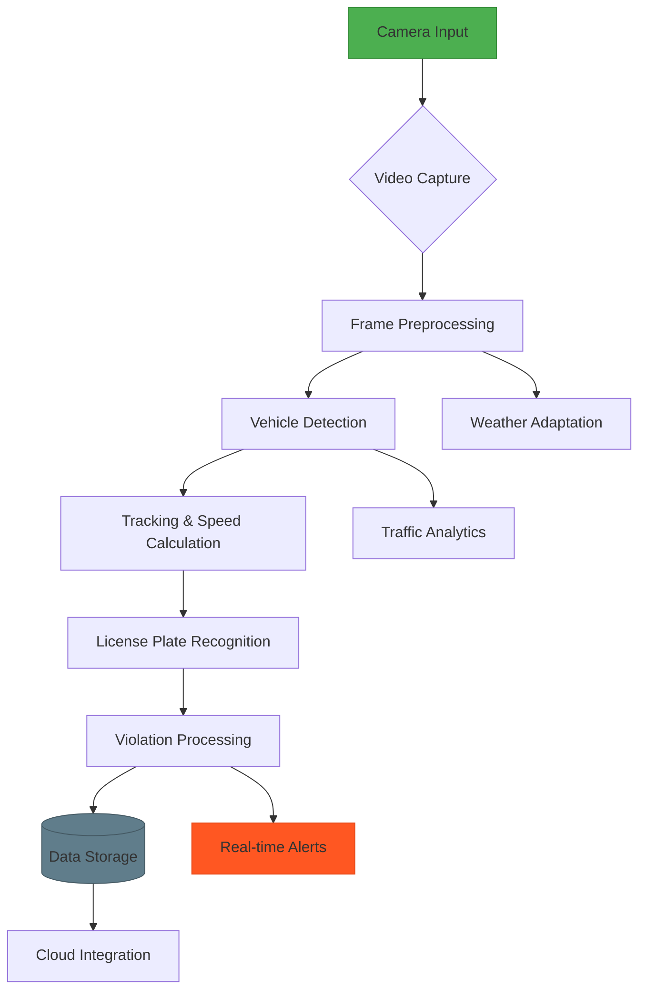

# 🚔 Speed Guardian Pro - Advanced Traffic Monitoring System


A state-of-the-art intelligent traffic monitoring system combining computer vision, deep learning, and IoT technologies for real-time vehicle detection, speed measurement, and traffic violation enforcement.

## 🌟 Features

- 🚗 Real-time vehicle detection (12+ classes)
- 📏 AI-powered speed estimation with sensor fusion
- 🚨 13+ violation types detection
- 📸 Automatic license plate recognition (LPR)
- 🌦️ Weather-adaptive processing
- ⚡ Hardware acceleration support (CUDA, TensorRT, TPU)
- 📊 Comprehensive traffic analytics
- 🔒 Secure data encryption and GDPR compliance
- 🌐 MQTT & REST API integration

## 🏗 System Architecture



## 🛠 Installation

### Requirements
- Ubuntu 20.04+ / Windows 10+
- NVIDIA GPU (Recommended) with CUDA 11.6+
- OpenCV 4.5+ with contrib modules
- TensorFlow 2.9+ / TensorRT 8.5+
- Mosquitto MQTT Broker
- SQLite3 / PostgreSQL

### Build Instructions
```bash
git clone https://github.com/awrsga/Speed-Guardian-Pro.git
cd Speed-Guardian-Pro

# Install dependencies
sudo apt install build-essential cmake libopencv-dev libmosquitto-dev

# Build project
mkdir build && cd build
cmake -DCMAKE_BUILD_TYPE=Release -DWITH_CUDA=ON ..
make -j$(nproc)
```

## ⚙ Configuration

Edit `config/speedguardian.json`:
```json
{
  "device": {
    "id": 1001,
    "location": {
      "latitude": 35.6895,
      "longitude": 139.6917
    }
  },
  "detection": {
    "model": "yolov5m",
    "confidence_threshold": 0.65
  },
  "speed": {
    "limit": 50.0,
    "tolerance": 3.0
  }
}
```

## 🚀 Usage

```bash
# Start with default config
./SpeedGuardian-Pro --config config/speedguardian.json

# Command-line options
--config        Specify configuration file
--resolution    Set processing resolution (e.g., 1920x1080)
--headless      Run without GUI
--demo          Use sample video input
```

## 📊 Data Management

Violation records are stored in SQLite/PostgreSQL with encrypted evidence:
```sql
CREATE TABLE violations (
  id INTEGER PRIMARY KEY,
  timestamp DATETIME,
  plate_number TEXT,
  speed REAL,
  location GEOGRAPHY,
  evidence_image BLOB
);
```

## 🤝 Contributing

1. Fork the repository
2. Create your feature branch (`git checkout -b feature/AmazingFeature`)
3. Commit your changes (`git commit -m 'Add some AmazingFeature'`)
4. Push to the branch (`git push origin feature/AmazingFeature`)
5. Open a Pull Request

## 📜 License

Distributed under Appache License. See `LICENSE` for more information.

## 📞 Contact

Amir Mohammad Parvizi - [official.parvizi@gmail.com](mailto:official.parvizi@gmail.com)

Project Link: [https://github.com/awrsha/Speed-Guardian-Pro](https://github.com/awrsha/Speed-Guardian-Proo)
